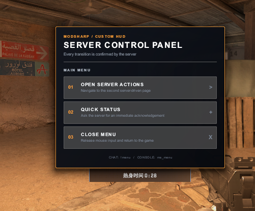

# CS2 `custom_hud_layout`：ModSharp 能力边界探针

[English](README.md) · [英文 build 2000891 报告](docs/custom-hud-build-2000891-retest.en.md) · [中文重测记录](docs/custom-hud-build-2000891-retest.zh-CN.md) · [截图证据](docs/evidence/README.zh-CN.md)

> **当前状态（2026-08-26，build 2000891）：Tool Mode 跨地图、本地预装普通客户端、服务器驱动状态与完整交互均已成功。** 除 `loadout.vxml_c` 的六个 dialog variables 和动态 class 外，本仓库现在还提供两页 `server_menu.vxml_c`：玩家输入 `.menu`（`!menu`、`/menu` 也由 CommandCenter 接受）后，服务端仅为该 slot 开启菜单与输入捕获；Button 点击经 `CS_UM_CustomHudClicked` receiver 回传 ModSharp，服务器再完成翻页、聊天输出、主题切换、返回和关闭。Windows 当前 build 已实际验证 click receiver、`SetHasClassForPlayer` 与 `SetInputCaptureEnabled`。此前 `invalid resource name` 来自动态实体错误使用源码名；运行时必须引用编译资源名 `.vxml_c`。packed retail VPK 与两种 loose 路径仍不同，不能由本次成功外推。完整勘误、实验索引和证据见 [《build 2000891 重测记录》](docs/custom-hud-build-2000891-retest.zh-CN.md)。
>
> build 2000891 发布前，普通客户端拒绝 addon VXML，而 Valve 内置 `btn_alert.vxml_c` 可以显示。旧实验不是无效结果，但只适用于当时的客户端 build；原始日志、转储哈希和 A/B 对照完整保留在[《普通客户端能力边界实测》](docs/custom-hud-retail-client-boundary.zh-CN.md)。

这个仓库用于验证一种与地图解耦的 Custom HUD 架构：客户端提供静态 VXML/CSS，ModSharp 在任意当前地图上动态创建 `custom_hud_layout` 网络实体。该架构已经在显式挂载 addon 的 Tool Mode 客户端和基础目录本地预装的普通客户端上端到端成立；packed Workshop/MMR VPK 与自动分发仍需分别验证。



```text
客户端 Panorama addon
VXML / CSS / images
          │
          │ 按实体中的逻辑资源路径加载
          ▼
custom_hud_layout 网络实体
          ▲                       │
          │ dialog variable/class │ buttonId + player
          │                       ▼
                 ModSharp 游戏模式
```

这里没有 Hammer 依赖，也不要求地图预放实体。地图只是游戏模式运行的场景；同一套 UI 可以用于官图或任意社区地图。

## 两种服务端控制器

Valve 官方 `script_zoo` 展示的是：

```text
cs_script 服务端 JavaScript → 地图中的 custom_hud_layout → 客户端 UI
```

本仓库使用的是：

```text
ModSharp C# → 动态创建 custom_hud_layout → 客户端 UI
```

两者操作的是同一种网络实体。被禁止的是 VXML 内部的 Panorama 客户端脚本和事件，不是服务端 JavaScript。官方声明与示例可在本地 Workshop Tools 内容中查看：

```text
content/csgo/maps/editor/zoo/scripts/setup.js
content/csgo/maps/editor/zoo/scripts/welcome.xml
content/csgo/maps/editor/zoo/scripts/welcome.css
content/csgo/maps/editor/zoo/scripts/point_script.d.ts
```

## 客户端资源结构

仓库中的客户端源码遵循 Panorama 的资源分层：

```text
addon/
└─ panorama/
   ├─ layout/custom_game/
   │  ├─ loadout.xml
   │  └─ server_menu.xml
   └─ styles/custom_game/
      ├─ loadout.css
      └─ server_menu.css
```

`loadout` 保留文本变量、动态 class、z-index 与缓存实验；`server_menu` 是当前两页交互场景。构建脚本默认编译交互菜单。

构建时 `.xml` / `.css` 源码会被暂存到 addon content 目录，再由 Valve 的 `resourcecompiler.exe` 生成：

```text
game/csgo_addons/panorama_layout/
└─ panorama/
   ├─ layout/custom_game/server_menu.vxml_c
   └─ styles/custom_game/server_menu.vcss_c
```

`custom_hud_layout` 的运行时 `layout` keyvalue 必须使用编译资源名并保留 `_c`：

```text
panorama/layout/custom_game/server_menu.vxml_c
```

Hammer/VMAP authoring 中常见的 `.vxml` 是源码依赖名，不能直接照搬到动态实体。build 2000891 本轮最重要的勘误就是：`.vxml` 会得到 `invalid resource name`，同一 Tool Mode addon 中正确的 `.vxml_c` 可以跨到 `de_dust2` 加载。

## 编译客户端 addon

安装 CS2 Workshop Tools 后运行：

```powershell
.\build-addon.ps1 `
    -Cs2Root "D:\game\SteamLibrary\steamapps\common\Counter-Strike Global Offensive"
```

脚本会完成以下操作：

1. 把 XML/CSS 暂存到 `content/csgo_addons/panorama_layout`。
2. 生成 addon 所需的 `addoninfo.txt` 与 Panorama preprocessor 配置。
3. 命令行调用 `resourcecompiler.exe`。
4. 验证 `.vxml_c` 与 `.vcss_c` 已出现在 `game/csgo_addons/panorama_layout`。

它不会修改 `gameinfo.gi`，也不会启动或关闭 CS2。

## 使用 Tools Mode 客户端连接 MMR 实例

从 Workshop Tools 选择 `panorama_layout` addon 启动。其启动模型等价于：

```text
cs2.exe -addon panorama_layout -tools
```

客户端不安装 ModSharp，也不启动本地 listen server。MMR 负责拉起独立 CS2 服务端、部署 ModSharp 与游戏模式模块，并选择实际运行的地图。

在 Tools Mode 控制台直接连接 MMR 分配的实例：

```text
connect <MMR instance address>
```

完整链路是：

```text
Tools 客户端
  -addon panorama_layout
  └─ 挂载 VXML/CSS
          │
          │ connect
          ▼
MMR 独立服务端
  ├─ 官方图或社区图
  ├─ ModSharp
  └─ PanoramaLayout/生化模式模块
          │
          └─ 创建 custom_hud_layout 并同步 UI 状态
```

服务端只需要模块和 ModSharp；Panorama VXML/CSS 是客户端资源，不需要为了 UI 改造或绑定服务器当前地图。客户端解析实体中的逻辑资源名时，会从已经挂载的 `panorama_layout` addon 中找到编译资源。

## ModSharp 端

核心入口位于 [`PanoramaLayoutPlugin.cs`](src/PanoramaLayout/PanoramaLayoutPlugin.cs)：

```csharp
var keyValues = new Dictionary<string, KeyValuesVariantValueItem>
{
    ["origin"] = "0 0 0",
    ["targetname"] = "panorama_server_menu",
    ["layout"] = "panorama/layout/custom_game/server_menu.vxml_c",
};

var layout = entityManager.SpawnEntitySync("custom_hud_layout", keyValues);
```

这与 Swiftly PoC 的 `CreateEntityByDesignerName + DispatchSpawn` 是同一层实体操作。项目只引用 NuGet 公版 API：

```xml
<PackageReference Include="ModSharp.Sharp.Shared"
                  Version="2.1.137"
                  PrivateAssets="all"
                  ExcludeAssets="runtime" />
<PackageReference Include="ModSharp.Sharp.Modules.CommandCenter.Shared"
                  Version="2.1.137"
                  PrivateAssets="all"
                  ExcludeAssets="runtime" />
```

实体创建仍只使用上述公版接口。状态与交互层从 [`gamedata/panorama_layout_customhud.jsonc`](gamedata/panorama_layout_customhud.jsonc) 解析当前场景所需的五个 CS 函数：`SetDialogVariableString`、`SetHasClass`、`SetHasClassForPlayer`、`SetInputCaptureEnabled` 和 `CustomHudClickedReceiver`。前两个保留既有 loadout 探针能力；后三个驱动 [`server_menu.xml`](addon/panorama/layout/custom_game/server_menu.xml) 的每玩家可见性、页面状态、鼠标输入和 Button 回传。它们只同步状态，不负责分发或挂载客户端 layout。

构建模块：

```powershell
dotnet build src\PanoramaLayout\PanoramaLayout.csproj `
    -c Release `
    -o .build\modules\PanoramaLayout
```

产物：

```text
.build/modules/PanoramaLayout/PanoramaLayout.dll
```

状态探针还要求把 gamedata 部署为：

```text
game/sharp/gamedata/panorama_layout_customhud.jsonc
```

模块以 `IGameData.Register("panorama_layout_customhud")` 注册它。gamedata 必须在模块加载前出现在该目录；DLL 热更新仍投递到模块的 `reload/` 子目录，并由下一次地图启动事件消费。

## 能力边界

Custom HUD 当前只支持 `Panel`、`Label`、`Image`、`Button` 和 CSS。布局是静态声明式结构，服务端可以：

- 设置 dialog variables；
- 切换 panel CSS classes；
- 为单个玩家覆盖状态；
- 开关输入捕获；
- 接收 Button 点击；
- 创建或销毁整个 layout 实体。

客户端不能在布局中运行 Panorama JS，也不能用 `onactivate` 等属性执行代码。CSS transition/animation 仍由客户端渲染。

本轮还验证了两种服务器状态通道：六个 dialog variables 完整显示，`SetHasClass("Loadout", "server-class-ok", true)` 也使客户端命中只存在于 VCSS 中的绿色激活态。VXML 本身没有预置该 class，因此这一视觉变化是独立的端到端证据。

复杂交互场景也已在 Windows 服务端实际通过：聊天输入 `.menu` 打开两页菜单并为调用 slot 开启 input capture；点击关闭按钮会释放输入。当前处理函数也把再次输入 `.menu` 实现为关闭 toggle。点击第一项由服务器切换两个 page Panel 的 `is-active`，第二页按钮能够输出聊天、显示确认状态、切换青色主题、返回和关闭。点击路径直接 hook `CustomHudClickedReceiver`，不依赖当前地图的 point_script/Pulse graph，也没有客户端 Panorama JS。默认 M 键的 `teammenu` 是客户端命令，不会进入服务端 CommandCenter listener；普通用户无需改 bind，使用 `.menu` 即可。

Custom HUD 与展开雷达的层叠顺序会受 Panorama stacking context、选择器和具体 HUD 状态影响。基础 `.loadout` 的 `z-index: 1000` 曾足以改变顺序；class 实验中又把 `z-index: 10000` 放到 `.loadout.server-class-ok` 后，绿色面板稳定绘制到雷达上方。这个问题可由 CSS 调整，但不应把某个固定数值描述成所有 HUD 组合下的永久保证。

Tool Mode 下由远端服务器动态创建的 Custom HUD 还表现出进程级资源缓存：运行时在 `4128` 字节故障版与 `4174` 字节修复版之间双向重新编译，当前画面均不变化；Asset Browser 选中资源和 `disconnect` 后重连也不会失效缓存，只有完整重启 Tool Mode 才稳定加载磁盘上的新 VCSS。这个结果严格限于本实验路径，不外推为所有地图 authoring 资源都不能热更新。

Tools Mode 已确认能让 addon 自定义 VXML/VCSS 脱离拥有它的 VMAP：`cs_script_demo_copy` 客户端进入独立服务器的 `de_dust2` 后，完整显示 `loadout.vxml_c` 及六个服务器变量。这个结果依赖正确的编译资源名和客户端显式 addon mount。

普通客户端基础目录 loose-file 已经用 `.vxml_c` 重测成功：无 `-tools`、无 `-addon` 的客户端可以加载本地预装的自定义布局和样式。这仍不证明 packed retail VPK 已经可用。实验参与者提供的 2026-08-26 Mapcore Discord 当日对话中，Valve 开发者针对 “packed addon outside of tools” 明确表示 packed VPK 内容进入 Panorama 仍有 hard stop，并计划修复；该材料没有公开链接，因此只作为当日上下文记录。

## 许可证

本项目采用 [MIT License](LICENSE) 开源。
