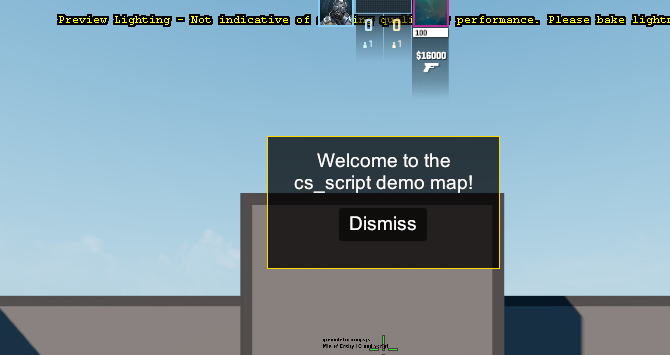
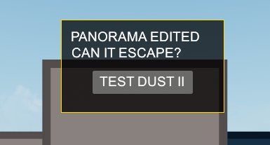
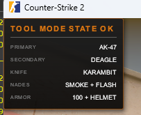
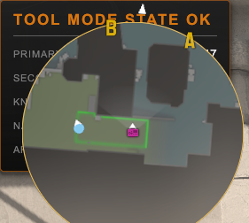
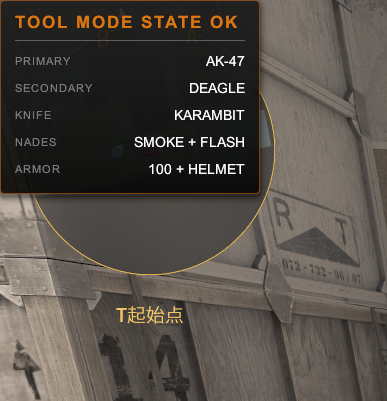
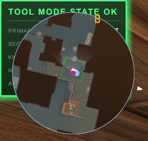
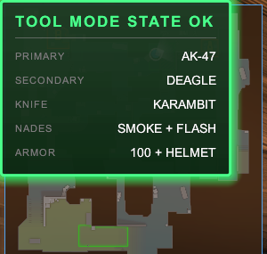
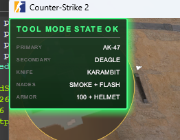

# CS2 `custom_hud_layout` build 2000891 重测记录

状态：**A/B/G/H/I/J/K 已完成；C/D 已勘误；packed retail VPK（E）待 Valve 修复后独立回归**<br>
开始日期：2026-08-26<br>
客户端/服务端版本：`2000891`<br>
PatchVersion：`1.41.7.7`<br>
SourceRevision：`10937988`

本文记录 Valve 在首次发布 `custom_hud_layout` 后追加 build 2000891 的完整重测过程。它不覆盖旧实验，而是把旧实验的适用版本、2000891 的变化、已经完成的验证和仍待验证的边界分开保存。

旧版失败证据见[《普通客户端能力边界实测》](custom-hud-retail-client-boundary.zh-CN.md)。

English version: [build 2000891 retest](custom-hud-build-2000891-retest.en.md) · 原始截图与 SHA-256：[`docs/evidence`](evidence/README.zh-CN.md)

## 当前结论

截至本文当前版本，可以确认：

1. build 2000891 正式允许 CS2 addon 编译位于 `panorama/layout/custom_game` 和 `panorama/styles/custom_game` 下的 Panorama 资源；
2. Valve 提供的 `cs_script_demo` 地图能够加载地图拥有的 `welcome.vxml`；
3. Workshop Tools 创建的可写副本 `cs_script_demo_copy` 能编译并显示用户实际修改过的 VXML；
4. 显式挂载 `cs_script_demo_copy` 的 Tool Mode 客户端进入 `de_dust2` 后，能够通过动态实体加载不属于当前 VMAP 的 `loadout.vxml_c`；
5. 同一布局完整接收并显示六个由服务器 gamedata/native setter 写入的 dialog variables；
6. 服务端通过 `CCSCustomHudLayout::SetHasClass` 给指定 Panel 动态加入 class 后，客户端命中了只存在于 VCSS 的绿色激活态；
7. 早先 `escape_probe.vxml` / `welcome.vxml` 的失败没有控制源码名 `.vxml` 与编译资源名 `.vxml_c`，因此不能证明地图资源归属限制；
8. 将同一 `loadout.vxml_c` / `loadout.vcss_c` 放入基础 `game/csgo/panorama` 后，无 `-tools`、无 `-addon` 的普通客户端也能跨地图完整显示，本地预装模型成立；
9. Tool Mode、基础目录 loose file 与 packed retail VPK 是不同加载路径。2026-08-26 Mapcore Discord 当日开发者对话称 packed VPK 进入 Panorama 仍有 hard stop；该材料由实验参与者提供、暂无公开链接，packed 路径仍需在 Valve 修复后独立回归。
10. Tool Mode 客户端从远端服务器接收动态 Custom HUD 时，外部重新编译 VCSS、Asset Browser 选中资源和断线重连都不会使已缓存样式失效；完整重启 Tool Mode 才加载新版本。
11. 两页交互菜单已在 Windows 服务端完成端到端验证：`.menu`、per-player class、input capture、Button receiver、服务器翻页、动作输出、主题切换、返回与关闭全部成功。默认 M 键的 `teammenu` 实测不会到达服务端；正常用户流程不依赖改键。

因此，以下命题必须继续分开：

```text
地图拥有的自定义 HUD 可编辑、可显示                    已确认
Tool Mode 显式挂载 addon 后跨到任意其他地图            已确认
服务器驱动自定义 layout 的 dialog variables            已确认
服务器给指定 Panel 动态切换 CSS class                  已确认
基础 game/csgo loose file 可直接成为 Custom HUD 资源   已确认
retail Workshop/MMR packed VPK                         与 Tool Mode 分离；当前有 hard-stop 报告
```

## 实验索引与判定术语

如果只关心当前可用能力，先看 G、H、I、K 和文末总判定矩阵；如果要理解 `invalid resource name` 为什么曾被误判为 VMAP/来源限制，再看 C、D。旧 build 的拒绝证据仍单独保存在历史文档中。

| 实验 | 唯一问题 | 客户端/资源路径 | 判定 | 当前用途 |
|---|---|---|---|---|
| A | Valve 官方地图拥有的 layout 能否显示 | Tool Mode + 当前 VMAP | **通过** | 官方阳性基线 |
| B | 用户修改后的 VXML 是否真的重新编译并运行 | Tool Mode + 当前 VMAP | **通过** | 排除回退到 Valve 预编译资源 |
| C | addon layout 能否跨 VMAP | Tool Mode + addon，但实体错误引用 `.vxml` | **受混杂；已勘误** | 保存 `invalid resource name` 的错误 suffix 证据 |
| D | 基础目录 loose file 能否被普通客户端加载 | 普通客户端 + loose file，但实体错误引用 `.vxml` | **受混杂；已勘误** | 保存文件打开前即失败的证据 |
| E | packed Workshop/MMR VPK 能否进入 Panorama | 普通客户端 + packed VPK | **待回归** | 与 Tool Mode、loose 预装严格分开 |
| F | 服务端 dialog variable 能否到达客户端 | Valve `btn_alert.vxml_c` | **通过** | 状态同步阳性基线 |
| G | 正确 `.vxml_c` 能否脱离当前 VMAP | Tool Mode + addon + `de_dust2` | **通过** | 推翻 C 的 VMAP 归因 |
| H | 本地预装 loose compiled resource 是否成立 | 普通客户端 + `game/csgo/panorama` | **通过** | 验证受控客户端预装模型 |
| I | 服务端能否动态切换 Panel class | 普通客户端 loose 资源 | **通过** | 无客户端 JS 的样式状态驱动 |
| J | 远端动态 HUD 的 VCSS 是否会热失效 | Tool Mode + 双向 CSS A/B | **负面结果** | 当前进程不刷新；完整重启才生效 |
| K | 能否组合成实际两页交互菜单 | Tool Mode + CommandCenter + Button receiver | **通过** | `.menu`、翻页、动作、主题和安全关闭 |

本文使用四种判定：

- **通过**：服务端证据与客户端实际画面/交互同时成立；
- **负面结果**：控制变量后稳定复现“不支持/不刷新”，它本身也是有效结论；
- **受混杂；已勘误**：原始观察真实，但实验同时改变了关键变量，不能支持当时的归因；
- **待回归**：当前没有满足证据要求的端到端结果，不从其他路径外推。

### 可复现入口

| 内容 | 仓库位置 |
|---|---|
| Tool Mode loadout 探针 | `addon/panorama/layout/custom_game/loadout.xml`、`addon/panorama/styles/custom_game/loadout.css` |
| 两页交互菜单 | `addon/panorama/layout/custom_game/server_menu.xml`、`addon/panorama/styles/custom_game/server_menu.css` |
| 动态实体、命令与页面状态机 | `src/PanoramaLayout/PanoramaLayoutPlugin.cs` |
| dialog/class/input native wrapper | `src/PanoramaLayout/CustomHudNativeProbe.cs` |
| Button receiver detour | `src/PanoramaLayout/CustomHudClickProbe.cs` |
| 当前五项 CS 函数 gamedata | `gamedata/panorama_layout_customhud.jsonc` |
| addon 编译入口 | `build-addon.ps1` |

会话中的 12 张原始 PNG 已从 Codex root session 保存的 data URI 无损解码到 [`docs/evidence`](evidence/README.zh-CN.md)。图片没有缩放、重压缩、裁剪或标注；清单记录了尺寸、字节长度和 SHA-256。截图仍不替代源码、编译日志、资源哈希与服务端日志。

## 一、为什么必须重测

旧实验并不是误测。它记录了当时客户端的真实行为：

```text
Addons cannot add layouts.
client disallowing panorama layout file creation
Layout xml did not pass CustomHud validation
```

但 build 2000891 改变了这些实验所依赖的客户端前提。

### 时间线

| 时间 | 事件 | 含义 |
|---|---|---|
| 2026-08-24 | Valve [首次公布 `custom_hud_layout`](https://steamcommunity.com/app/730/announcements) | 官方声明支持 Panel、Label、Image、Button 和 CSS，不支持客户端脚本 |
| 2026-08-24 23:42 UTC | GameTracking build 2000888 提交 `fd04856` | 首次出现 Custom HUD 实体、API、官方 zoo 示例等内容 |
| 2026-08-26 00:45–01:34 UTC+8 | 本项目完成旧版自定义 addon 与 `btn_alert` A/B 实验 | addon VXML 被拒绝；Valve 基础布局成功显示 |
| 2026-08-25 19:52:46 UTC / 2026-08-26 03:52:46 UTC+8 | Steam 发布 [build 24934554](https://steamdb.info/patchnotes/24934554/) | 无官方 patch notes，但发布时间晚于旧实验 |
| 2026-08-25 19:58 UTC | GameTracking 提交 [`acfe24d`](https://github.com/SteamTracking/GameTracking-CS2/commit/acfe24d588d2df0a26da0f964e44d780bd3070eb) | build 2000891 落盘，包含 Custom UI 开关和 addon 打包规则变更 |
| 2026-08-26 | Steam 完整性验证后重新检查本机 | 确认本机正式文件已经是 2000891，未手工修改 `gameinfo.gi` |

旧实验没有单独保存当时的 `steam.inf`。将其归入 build 2000888 是依据旧实验时间和 GameTracking/Steam 发布时间作出的版本推断；旧证据的确定事实是：它发生在 build 2000891 发布之前。

### build 2000891 的决定性差异

#### 1. 客户端总开关打开

`game/csgo_core/gameinfo.gi`：

```diff
-"AllowCustomGameUI" 0
+"AllowCustomGameUI" 1
```

#### 2. addon VPK 允许包含 Custom Game Panorama

`game/csgo/gameinfo.gi` 的 `AddonConfig/VpkDirectories` 新增：

```text
"include" "panorama/layout/custom_game"
"include" "panorama/styles/custom_game"
```

#### 3. Workshop Tools 不再隐藏布局和样式资源类型

`game/bin/assettypes_common.txt` 中的 `panorama_style` 和 `panorama_layout` 均保留 `CompilePanorama`，并移除了针对 `csgo` 的 `m_HideForRetailMods`。

#### 4. Valve 自己发布了 addon 形式的完整示例

build 2000891 新增 `cs_script_demo`。其只读资产清单明确包含：

```text
panorama/layout/custom_game/welcome.vxml
panorama/styles/custom_game/welcome.vcss
```

这四项变化直接命中了旧实验的失败阶段，因此不能把 build 2000888 的失败结果无条件外推到 2000891。

## 二、实验设计

### 必须控制的三个变量

| 变量 | 取值 | 要回答的问题 |
|---|---|---|
| 布局是否属于当前地图 | VMAP 引用 / VMAP 不引用 | CustomHud 是否仍要求当前地图拥有资源 |
| 客户端如何挂载资源 | Tool Mode 显式 addon / 普通客户端自动分发 | 加载权限与分发机制是否都已打通 |
| 实体从哪里产生 | VMAP 预放 / ModSharp 动态创建 | 成功是否依赖 Hammer 预放实体 |

不能用一个场景同时替代另外两个场景。例如，`cs_script_demo` 中显示 Welcome 面板不能直接证明 `de_dust2` 上的 ModSharp 动态实体也能加载该布局。

### 证据要求

每次实验至少保存：

1. `steam.inf` 中的 ClientVersion、ServerVersion、PatchVersion 和 SourceRevision；
2. 客户端启动模式、显式挂载的 addon 名称；
3. 服务器地图、模块 build 时间和 layout 逻辑路径；
4. 服务端实体创建日志；
5. 客户端 CustomHud/Panorama 控制台日志；
6. 实际画面截图；
7. VXML/Vcss 编译产物时间与 SHA-256；
8. 当前 VMAP 是否包含该 layout 的 `map_asset_references` 证据。

以下推论仍然禁止：

```text
服务端实体成功 ≠ 客户端 UI 成功
文件已经下载 ≠ 文件已经挂载
文件已经挂载 ≠ CustomHud 验证通过
某张地图能显示 ≠ 任意地图都能显示
Tool Mode 能显示 ≠ 普通客户端能自动获得并显示
```

## 三、环境完整性检查：通过

Steam 完整性验证完成后，本机读取到：

```text
ClientVersion=2000891
ServerVersion=2000891
PatchVersion=1.41.7.7
SourceRevision=10937988
VersionDate=Aug 25 2026
VersionTime=11:28:13
```

同时确认：

- `AllowCustomGameUI` 的官方值为 `1`；
- addon VPK 白名单包含两个 `custom_game` 目录；
- `resourcecompiler.exe` 存在；
- Panorama Style/Layout 均使用 `CompilePanorama`；
- 两种资源类型均不再对 CS2 retail mods 隐藏；
- 官方 `cs_script_demo` 的 VPK、VJS、VXML 和 VCSS 编译产物完整存在。

该阶段没有修改任何 CS2 官方文件。

## 四、实验 A：官方地图拥有的布局

### 步骤

1. 从 Workshop Tools 复制 Valve 的只读 `cs_script_demo`；
2. Tools 创建可写 addon `cs_script_demo_copy`；
3. 加载其中的 `cs_script_demo` 地图；
4. 观察 Welcome 面板与 Dismiss 按钮。

### 文件状态

复制版同时存在于：

```text
content/csgo_addons/cs_script_demo_copy
game/csgo_addons/cs_script_demo_copy
```

源码：

```text
panorama/layout/custom_game/welcome.xml
panorama/styles/custom_game/welcome.css
```

编译产物：

```text
panorama/layout/custom_game/welcome.vxml_c
panorama/styles/custom_game/welcome.vcss_c
```

### VMAP 归属证据

`cs_script_demo.vmap` 是 binary DMX。对其二进制字符串和属性表检查后确认：

```text
map_asset_references
└─ panorama/layout/custom_game/welcome.vxml

custom_hud_layout
├─ targetname = welcome_layout
└─ layout = panorama/layout/custom_game/welcome.vxml
```

VMAP 同时引用 `maps/scripts/setup.vjs`。因此这个场景属于：

```text
当前地图声明 layout 依赖
+ 当前地图预放 custom_hud_layout
+ 当前地图脚本控制实体
```

### 结果：通过

实际画面出现：

```text
Welcome to the cs_script demo map!
[ Dismiss ]
```



### 结论范围

该结果证明 build 2000891 的官方地图 Custom HUD 路径正常，也证明 addon 能携带被当前地图拥有的自定义 VXML/CSS。

它不证明布局能够脱离当前地图的 `map_asset_references`。

## 五、实验 B：用户修改地图拥有的布局

### 目的

排除客户端只接受 Valve 随 build 提供的原始预编译资源。验证用户修改后的 VXML 能被 Workshop Tools 重新编译并由客户端实例化。

### 控制变量

只修改 `welcome.xml`；不修改：

- `welcome.css`；
- `cs_script_demo.vmap`；
- 地图脚本；
- `custom_hud_layout` 实体属性；
- 客户端 `gameinfo.gi`。

### 修改内容

```xml
<Panel id="dialog" class="Dismissed">
    <Label class="Body" text="PANORAMA EDITED" />
    <Label class="Body" text="CAN IT ESCAPE?" />
    <Button id="dismiss_button">
        <Label text="TEST DUST II" />
    </Button>
</Panel>
```

相对于原布局，这次实验同时验证：

- 修改已有 Label 文案；
- 新增一个 Label；
- 修改 Button 子 Label 文案。

### 编译证据

Workshop Tools 检测到源码变化并自动重新生成：

```text
game/csgo_addons/cs_script_demo_copy/
└─ panorama/layout/custom_game/welcome.vxml_c
```

记录：

```text
源码更新时间：2026-08-26 11:22:29 UTC+8
产物更新时间：2026-08-26 11:22:50 UTC+8
产物 SHA-256：CF08A093BC8F7B94B87F2A559A8CE2A30AD51894DB6710F6A43D1BB3A30A32BD
```

对编译产物做二进制文本检查，可以恢复：

```text
PANORAMA EDITED
CAN IT ESCAPE?
TEST DUST II
```

### 运行结果：通过

实际客户端画面同步显示新增和修改后的全部文本。



### 结论范围

该实验已经证明：

> build 2000891 中，用户可以真正修改、编译并运行自定义 Panorama VXML；客户端不是在回退到 Valve 原始预编译布局。

但 `welcome.vxml` 仍由当前 `cs_script_demo.vmap` 声明为地图资产，所以本实验仍然不能回答 “CAN IT ESCAPE?”。

## 六、实验 C：错误 suffix 导致的跨地图误判（保留作勘误）

状态：**已完成；原“跨地图失败”结论已由实验 G 推翻**

### 目标

验证以下链路：

```text
Tool Mode 客户端显式挂载 cs_script_demo_copy
        │
        │ connect
        ▼
独立服务器运行 de_dust2
        │
        └─ ModSharp 动态创建 custom_hud_layout
              layout = panorama/layout/custom_game/escape_probe.vxml
```

### 为什么新建 `escape_probe.vxml`

不能继续把 `welcome.vxml` 当作唯一证据，因为：

1. 它已经出现在 `cs_script_demo.vmap` 的 `map_asset_references`；
2. 它默认带有 `Dismissed` class；
3. 在 demo 地图中，`setup.vjs` 会控制这个实体；
4. 复用它会让“资源归属”和“默认可见状态”两个变量混在一起。

新的 `escape_probe.vxml` 必须满足：

- 位于 `panorama/layout/custom_game`；
- 不被任何 VMAP 引用；
- 默认可见，不依赖 `Dismissed` class；
- 不依赖客户端脚本或地图脚本；
- 文案和视觉特征唯一，避免与缓存或旧布局混淆；
- 编译后记录 SHA-256；
- 创建实体前再次确认 `cs_script_demo.vmap` 中不存在 `escape_probe` 字符串。

### MMR 实例 mount

本实验有意只给 Tool Mode 客户端显式挂载 Panorama addon；独立服务器只部署 ModSharp 和服务端探针模块。该配置用于回答“客户端已经挂载资源时，是否足以让动态实体跨地图引用它”，不把服务端也运行 addon 模式混入同一轮变量。

本机 `C:/workshop/projects/playground/instance.config.ts` 使用以下 symlink mount：

```ts
const panoramaLayout = {
  "C:/workshop/projects/PanoramaLayout/.build/modules/PanoramaLayout":
    "game/sharp/modules/PanoramaLayout",
};

// mount.symlink
{
  ...panoramaLayout,
}
```

配置中的服务器启动地图保持：

```text
+map de_dust2
```

直接挂载项目构建目录可以避免把 DLL 再复制进 MMR 实例。首次启动前必须确认 `.build/modules/PanoramaLayout` 是本轮产物；运行中更新则不能直接覆盖模块根目录，而应把新产物投递到 `.build/modules/PanoramaLayout/reload`，再触发一次地图启动事件。

ModSharp 官方实现将每个模块目录下的 `reload` 定义为更新暂存目录，并在 `OnStartupServerPre` 中执行 `Unload → Update → Load(hotReload: true)`。本轮使用 `map de_dust2` 触发，CS2 服务端进程本身不重启。参见官方 [`ModSharpModule.cs`](https://github.com/Kxnrl/modsharp-public/blob/master/Sharp.Core/ModSharpModule.cs) 和 [`SharpModuleManager.cs`](https://github.com/Kxnrl/modsharp-public/blob/master/Sharp.Core/Managers/SharpModuleManager.cs)。

### 2026-08-26 服务端执行记录

本轮已经完成以下准备和服务器侧验证：

- 新建 `panorama/layout/custom_game/escape_probe.xml`，唯一文案为 `PANORAMA ESCAPED`、`HELLO, DUST II` 和 `NOT IN VMAP`；
- 该布局默认可见，不引用客户端脚本，也不带 `Dismissed` class；
- Workshop Tools 未在 20 秒观察窗口内自动发现新文件，因此使用当前 CS2 Tools 自带的 `resourcecompiler.exe` 手工编译；
- 编译结果为 `1 compiled, 0 failed, 0 skipped`；
- 产物 `escape_probe.vxml_c` 的 SHA-256 为 `A805C1583276F23CC58AF2337C0037B05DF63289B814C69B05CB68D25D72134D`；
- 对二进制 `cs_script_demo.vmap` 再次查找字符串：`welcome.vxml` 存在，`escape_probe` 不存在；
- 探针模块已重新构建到 `.build/modules/PanoramaLayout`，构建为 `0 errors, 0 warnings`；
- `cs2-dev` MMR 实例于 2026-08-26 12:15（Asia/Taipei）启动并保持运行。

服务端控制台给出了两条关键证据：

```text
Loading PanoramaLayout build 2026-08-26T04:13:58Z; hotReload=False
Spawned public-API custom_hud_layout entity 303:
target=panorama_layout_probe,
layout=panorama/layout/custom_game/escape_probe.vxml,
path=IEntityManager.SpawnEntitySync
```

`status` 同时确认实际地图不是 demo vmap：

```text
udp/ip   : 192.168.252.1:27015 (public 122.235.139.16:27015)
loaded spawngroup(1): de_dust2
```

这证明服务端模块、动态实体和 `de_dust2` 网络同步入口已经成立。它仍不能单独证明客户端接受并渲染该 VXML；最终结论必须以显式挂载 `cs_script_demo_copy` 的 Tool Mode 客户端画面和控制台为准。

### 客户端结果与对照

#### C1：首次加载 `escape_probe`

Tool Mode 客户端成功连接 `de_dust2`，服务端 `status` 确认玩家 `laper32` 为 `active`。客户端随后报告：

```text
Layout xml is an invalid resource name "panorama/layout/custom_game/escape_probe.vxml"
```

首次失败时检查 `game/csgo_addons/cs_script_demo_copy/tools_asset_info.bin`，其中存在 `welcome`，但尚不存在新建的 `escape_probe`。因此先不把这次失败归因于跨地图边界，而是重启 Workshop Tools，让客户端重新扫描 addon。

重启后再次检查，`tools_asset_info.bin` 已明确包含 `escape_probe`。在此状态重新连接同一服务器，客户端仍报告完全相同的 `invalid resource name`。这排除了“只是 Tool Mode 会话没有刷新新资产索引”。

#### C2：切换到已知可用的 `welcome.vxml`

为了排除新文件、文件名和编译方式差异，服务端模块热更新为：

```text
layout=panorama/layout/custom_game/welcome.vxml
```

该资源同时满足：

- 已存在于 `tools_asset_info.bin`；
- 已由 Valve demo vmap 的 `map_asset_references` 声明；
- 已在 `cs_script_demo_copy` 地图内实际显示；
- 已通过修改文案证明是用户重新编译的版本。

服务端在 `de_dust2` 生成新实体后，客户端仍报告：

```text
Layout xml is an invalid resource name "panorama/layout/custom_game/welcome.vxml"
```

当时据此推断失败与 `escape_probe` 是否新建无关，并进一步归因于资源离开 demo vmap。实验 G 后确认这个推断遗漏了共同变量：两个失败路径都向动态实体传入 `.vxml`，而不是运行时要求的 `.vxml_c`。

#### C3：Valve 基础布局阳性对照

最后保持客户端、服务器、地图、ModSharp API 和实体创建方式不变，只把 layout 热更新为：

```text
panorama/layout/btn_alert.vxml_c
```

服务端记录：

```text
Loading PanoramaLayout build 2026-08-26T04:40:42Z; hotReload=True
Module [PanoramaLayout] reloaded successfully
Spawned public-API custom_hud_layout entity 279:
layout=panorama/layout/btn_alert.vxml_c
```

客户端重新进入后，实际画面出现了 CS2 基础 HUD 的 `btn_alert` 横向提示条；用户提供的截图同时保留了生命值、武器信息等 `de_dust2` 实战 HUD，可排除回到了 demo vmap。

#### 实验 C 结论

本轮 A/B/C 对照得到：

| 当前地图 | layout 来源 | 客户端结果 |
|---|---|---|
| `cs_script_demo_copy` demo vmap | addon `welcome.vxml` | 显示；用户修改可见 |
| `de_dust2` | addon 新建 `escape_probe.vxml` | `invalid resource name` |
| `de_dust2` | addon 已知可用 `welcome.vxml` | `invalid resource name` |
| `de_dust2` | Valve 基础 `btn_alert.vxml_c` | **实际显示** |

这张表当时看似只剩“地图资源归属”一个变量，实际还同时改变了资源名 suffix：两个自定义负例使用 `.vxml`，Valve 阳性对照使用 `.vxml_c`。因此 C 只能保留三次原始观察，不能继续支持“自定义布局不能脱离当前 VMAP”的解释。实验 G 使用自定义 `loadout.vxml_c` 在同一 `de_dust2` 上成功，正式推翻原结论。

### 步骤

1. 新建并编译 `escape_probe.vxml`；
2. 将探针模块的 layout 指向 `panorama/layout/custom_game/escape_probe.vxml`；
3. 重新构建到 `.build/modules/PanoramaLayout`；
4. 检查 MMR symlink mount 的源目录、DLL 和目标目录；
5. 保持 Tool Mode 客户端以 `cs_script_demo_copy` addon 启动；
6. 启动独立 CS2 服务器，地图选择 `de_dust2`；
7. 模块通过 `IEntityManager.SpawnEntitySync` 动态创建 `custom_hud_layout`；
8. Tool Mode 客户端直接连接该服务器；
9. 保存服务端生成日志、客户端控制台和实际画面；
10. 在同一场景用 Valve `btn_alert.vxml_c` 做阳性对照。

### 判定

| 结果 | 能够证明什么 |
|---|---|
| `escape_probe` 在 `de_dust2` 显示 | 已挂载 addon 的布局不要求属于当前地图，可以由动态实体跨地图加载 |
| 实体成功但 CustomHud 拒绝 `.vxml` | 先改用编译资源名 `.vxml_c`；不能直接推断地图归属限制 |
| `btn_alert.vxml_c` 成功而 `escape_probe.vxml` 失败 | 实体链路正常，但 suffix 未控制，不能归因于资源来源 |
| 两者都失败 | 先排查服务器、模块、版本或实体同步，不能据此判断资源边界 |

## 七、实验 D：普通客户端 loose-file 初测（suffix 未控制）

状态：**原始否定结论无效；实验 H 已用 `.vxml_c` 重测成功**

### 目标

验证一种本地预装需求模型：不通过 Tool Mode、addon mount 或 `gameinfo.gi` override，而是由部署程序预先把编译资源直接放入基础游戏搜索路径。

本轮保持 `escape_probe.vxml_c` 字节完全不变，只把 provenance 从 `game/csgo_addons` 改为：

```text
game/csgo/panorama/layout/custom_game/escape_probe.vxml_c
game/csgo/panorama/styles/custom_game/welcome.vcss_c
```

复制前两个目标文件均不存在，所以没有覆盖 Valve 或其他已有本地文件。记录如下：

| 文件 | 长度 | SHA-256 |
|---|---:|---|
| `escape_probe.vxml_c` | 1562 | `A805C1583276F23CC58AF2337C0037B05DF63289B814C69B05CB68D25D72134D` |
| `welcome.vcss_c` | 2391 | `FB632BD0FFD92ED0A2B5EBE3D4191E20C81CAD27946609EFA0802B400B1328EC` |

客户端条件：

- 完全退出 Workshop Tools；
- 从 Steam 正常启动 CS2；
- 不使用 `-tools`；
- 不使用 `-addon`；
- 不修改 `gameinfo.gi`；
- 连接仍在运行 `de_dust2` 的同一 MMR 服务器。

服务端当时热更新为：

```text
layout=panorama/layout/custom_game/escape_probe.vxml
```

客户端原始结果：

```text
[custom_hud] Layout xml is an invalid resource name "panorama/layout/custom_game/escape_probe.vxml"
```

### 勘误后的解释边界

`[custom_hud]` 前缀说明错误由 Custom HUD 子系统在接受实体 `layout` 字段时产生。实验 G 已证明，在 Tool Mode 中把同类动态实体从 `.vxml` 改为 `.vxml_c` 后，自定义布局可以跨地图加载。因此本轮错误首先说明传入了无效的运行时资源名，不能说明 loose file 的物理来源被拒绝。

因此，这条日志不能回答 `filesystem_stdio` 是否能够枚举或打开物理 loose file，也不能证明物理文件存在仍然“不足以”加载。文件虽然是 `.vxml_c`，实体请求的却是 `.vxml`，实验在文件打开前已经因资源名错误结束。

普通客户端基础目录预装模型随后由实验 H 按上述条件重测，并使用 `panorama/layout/custom_game/loadout.vxml_c` 成功显示。因此实验 D 的原始日志现在只用于记录错误 suffix 的表现。

确认物理 VPK 重打包不再构成独立的跨地图变量后，已删除上述两份哈希匹配且实验前不存在的 loose 文件。没有删除父目录或其他游戏文件；如需进一步恢复，仍可运行 Steam 完整性验证。

## 八、实验 E：packed retail Workshop/MMR VPK（待回归）

状态：**独立阻塞项；不能由 Tool Mode 成功替代**

Tool Mode 使用开发态 loose 输出、`tools_asset_info.bin` 和显式 `-addon ... -tools` 挂载；packed retail VPK 走另一条客户端加载路径。实验 G 证明前者可以跨地图，不证明后者能够把 Panorama 内容带入普通客户端。

实验参与者提供的 2026-08-26 Mapcore Discord 当日对话中，Valve 开发者针对 “packed addon outside of tools” 回答 packed VPK 内容进入 Panorama 仍存在 hard stop，并称将修复。该对话没有公开链接，本文把它记录为当日工程上下文，不替代可复现测试。Valve 修复后执行 retail Workshop/MMR VPK 实验时，应继续要求：

- 客户端不使用 Tool Mode；
- 客户端不带 `-addon` 启动参数；
- 客户端不修改 `gameinfo.gi`；
- 当前地图是官图或与 HUD 无关的社区图；
- Workshop/MMR 完成资源分发；
- 客户端自动挂载资源；
- ModSharp 动态实体引用自定义 VXML；
- UI 实际显示且没有 CustomHud validation 错误。

这一阶段必须分别记录“文件下载”“VPK 挂载”“客户端是否退出”“布局验证”和“最终渲染”，不能只看 Workshop 下载完成或服务端实体日志。

## 九、实验 F：服务器驱动 dialog variable

状态：**通过；服务端写入与客户端变量渲染均已确认**

### 目标

前几轮已经用 Valve `btn_alert.vxml_c` 证明实体、网络入口和基础布局渲染成立，但当时没有设置布局状态，因此提示条内没有文字。本轮把“资源能否被接受”和“服务器能否驱动布局状态”拆成两个互不替代的实验：

```text
layout 继续使用 Valve btn_alert.vxml_c
        │
        ├─ 不触碰自定义 VXML 准入边界
        │
        └─ 只设置 MainMenuWatchAlertText/alert_value
                          = GAMEDATA 2000891 OK
```

### 最小移植范围

参考 `C:/workshop/projects/cs2-customhud` 的当前实现，只移植：

1. `CCSCustomHudLayout::SetDialogVariableString` 的 Linux/Windows signature；
2. `IGameData.Register/Unregister` 生命周期；
3. `CUtlString` 三参数封送；
4. 一次全局 dialog variable 写入。

当时没有移植 class toggle、per-player state、input capture 或 click receiver。gamedata address key 使用实际 CS 函数名 `CCSCustomHudLayout::SetDialogVariableString`；项目身份由 gamedata 文件名区分，不写进函数名。

仓库文件：

```text
gamedata/panorama_layout_customhud.jsonc
src/PanoramaLayout/CustomHudNativeProbe.cs
```

运行时 gamedata 路径：

```text
game/sharp/gamedata/panorama_layout_customhud.jsonc
```

这条 gamedata 只负责定位服务器原生状态 setter。它不能让任意 VXML 通过客户端的 `invalid resource name` 校验，也不用于修改客户端文件。

### 2026-08-26 服务端执行记录

模块构建结果：

```text
0 errors, 0 warnings
```

新产物被投递到：

```text
.build/modules/PanoramaLayout/reload
```

随后向仍在运行的 `cs2-dev` 发送 `map de_dust2`，ModSharp 消费 `reload` 并完成热更新；CS2 服务端进程没有重启。日志确认：

```text
Registered gamedata panorama_layout_customhud.jsonc
Resolved CCSCustomHudLayout::SetDialogVariableString at 0x7FF889583C20
Spawned custom_hud_layout entity 472:
layout=panorama/layout/btn_alert.vxml_c,
dialogVariable=MainMenuWatchAlertText/alert_value,
value=GAMEDATA 2000891 OK,
nativeApplied=true
Module [PanoramaLayout] reloaded successfully
```

因此服务端侧已经确认：gamedata 文件被读取、当前 Windows signature 成功解析、`CUtlString` 调用返回、实体在 `de_dust2` 上生成，服务器进程保持运行。

### 客户端结果：通过

普通客户端连接同一 `cs2-dev` 后，`btn_alert` 的橙色提示条实际显示：

```text
GAMEDA...
```


该前缀与本轮唯一注入值 `GAMEDATA 2000891 OK` 一致。尾部省略号来自 Valve 预制 `btn_alert` 的可用文字宽度和溢出样式；此前未设置 `alert_value` 时同一布局只有橙色底板、没有文字。因此，即使预制布局没有显示完整字符串，这个 A/B 差异仍足以确认客户端收到了 dialog variable 并执行了变量替换。

判定矩阵：

| 客户端结果 | 判定 |
|---|---|
| 显示 `GAMEDA...`（本轮实际结果） | **通过**：全局 dialog variable 已经通过网络状态同步到客户端，并由 Valve 布局完成变量替换；字符串因预制样式被截断 |
| 仍显示底板但没有文字 | 资源与实体链路仍正常；继续核对 panel id、变量名或 setter 的状态写入语义 |
| 客户端报告 layout 错误 | 本轮 Valve 阳性对照条件发生变化，不能归因于 gamedata |
| 服务端退出 | 需要回查 signature/ABI；不能把 `nativeApplied=true` 当成客户端成功 |

本轮由实际客户端画面确认状态同步通过。原始视觉证据已独立归档到 [`docs/evidence`](evidence/README.zh-CN.md)，并记录字节长度与 SHA-256。

## 十、实验 G：Tool Mode + `cs2-customhud` loadout 跨地图

状态：**通过；并推翻实验 C 的资源归属解释**

### 为什么必须做这一轮

实验 C 的两个自定义负例都把源码依赖名传给动态实体：

```text
panorama/layout/custom_game/escape_probe.vxml
panorama/layout/custom_game/welcome.vxml
```

阳性对照却使用编译资源名：

```text
panorama/layout/btn_alert.vxml_c
```

`cs2-customhud` 的示例命令同样明确使用 `loadout.vxml_c`。因此实验 C 并没有只改变资源来源，还混入了 `.vxml` / `.vxml_c` 差异。本轮保持 Tool Mode、addon、服务器、地图和动态实体方式不变，使用真正的自定义编译资源名补齐控制。

### 上游 layout 的最小编译修正

首先把 `C:/workshop/projects/cs2-customhud/content/panorama` 中的 `loadout.vxml` / `loadout.vcss` 带入 `cs_script_demo_copy`。原版 VXML 在当前 build 的 ResourceCompiler 下直接失败：

```text
RESOURCE COMPILE ERROR:
Found root panel with 'id' attribute, which is not permitted.
```

Valve 已知可编译的 `welcome.xml` 在 `<root>` 下先放置无 id 的根 Panel，再把有 id 的业务 Panel 作为子级。本轮只做相同的结构修正：

```xml
<Panel class="Root">
    <Panel id="Loadout" class="loadout">
        ...原有 Label 与变量绑定不变...
    </Panel>
</Panel>
```

修正后结果：

```text
OK: 2 compiled, 0 failed, 0 skipped
```

| 产物 | 长度 | SHA-256 |
|---|---:|---|
| `loadout.vxml_c` | 1799 | `BEBDA146C7F44F23206B0A90EB91F58A84F624A932C53B0D800DAA87A9F359EB` |
| `loadout.vcss_c` | 3721 | `DABCBFAA21C834AA214BDC7AB16455DCA9A6E7E2110158AC304D2573A16E4DA2` |

仓库保存的修正版源码为：

```text
addon/panorama/layout/custom_game/loadout.xml
addon/panorama/styles/custom_game/loadout.css
```

### 跨地图与挂载控制

Tool Mode 启动参数由实际进程命令行确认：

```text
cs2.exe -addon cs_script_demo_copy -tools ... -insecure
```

Tools 启动扫描后，`tools_asset_info.bin` 明确新增 `loadout`；该索引记录为：

```text
长度：5218
更新时间：2026-08-26 13:46:31 UTC+8
SHA-256：A1C2FFCD1426D361974EF5A81AAB824C8026E5EBD6ECB8C0AD3C6554112C267F
```

`cs_script_demo.vmap` 的 `map_asset_references` 仍只有 `welcome.vxml`，全文不存在 `loadout`。VMAP SHA-256 为：

```text
CA1FC0E13C1BF590A966A02F546793FAC8552B0A15032FC7BAA4169DE5035F29
```

客户端随后没有运行 demo vmap，而是连接独立 MMR 服务器；服务端保持：

```text
map = de_dust2
layout = panorama/layout/custom_game/loadout.vxml_c
```

### 服务端状态写入

探针使用实验 F 已验证的同一条 native setter，依次写入：

```text
LoadoutName/pname           = TOOL MODE STATE OK
LoadoutPrimary/primary      = AK-47
LoadoutSecondary/secondary  = DEAGLE
LoadoutKnife/knife          = KARAMBIT
LoadoutNades/nades          = SMOKE + FLASH
LoadoutArmor/armor          = 100 + HELMET
```

服务端日志确认：

```text
Resolved CCSCustomHudLayout::SetDialogVariableString at 0x7FF889583C20
Spawned custom_hud_layout entity 83:
layout=panorama/layout/custom_game/loadout.vxml_c,
dialogVariablesApplied=6/6
```

### 客户端结果：通过

用户提供的实际客户端截图显示了完整的右侧 Loadout 面板、自定义黑橙 CSS 和全部六个值：

```text
TOOL MODE STATE OK
PRIMARY      AK-47
SECONDARY    DEAGLE
KNIFE        KARAMBIT
NADES        SMOKE + FLASH
ARMOR        100 + HELMET
```



这同时证明：

1. addon 自定义 `loadout.vxml_c` 能在无关的 `de_dust2` 上由动态实体加载；
2. 当前 VMAP 不需要声明该资源；
3. 自定义 `loadout.vcss_c` 已加载并生效；
4. 六个自定义 panel id / dialog variable 均完成服务器到客户端同步；
5. 实验 C 的 `invalid resource name` 来自错误的 `.vxml` 运行时资源名，不能归因于地图资源归属。

该结论严格限于显式 `-addon ... -tools` 客户端。它不证明普通客户端能够加载基础目录 loose file，也不证明 packed Workshop/MMR VPK 已经通过当前 hard stop。

## 十一、实验 H：普通客户端基础目录 loose-file

状态：**通过；本地预装模型成立**

### 目标与唯一变量

实验 G 已证明 Tool Mode addon 中的 `loadout.vxml_c` 可以跨到 `de_dust2`。本轮保持以下条件完全不变：

- 同一个独立 `cs2-dev` 服务端；
- 同一张 `de_dust2`；
- 同一个动态 `custom_hud_layout` 实体路径；
- 同一组六个 dialog variables；
- VXML/VCSS 字节与 SHA-256。

唯一改变的是客户端资源来源：

```text
实验 G：game/csgo_addons/cs_script_demo_copy + -addon ... -tools
实验 H：game/csgo/panorama                 + 普通客户端
```

### 文件部署证据

复制前两个基础目录目标均不存在，没有覆盖 Valve 或其他已有文件。部署为：

```text
game/csgo/panorama/layout/custom_game/loadout.vxml_c
game/csgo/panorama/styles/custom_game/loadout.vcss_c
```

| 文件 | 长度 | SHA-256 |
|---|---:|---|
| `loadout.vxml_c` | 1799 | `BEBDA146C7F44F23206B0A90EB91F58A84F624A932C53B0D800DAA87A9F359EB` |
| `loadout.vcss_c` | 3721 | `DABCBFAA21C834AA214BDC7AB16455DCA9A6E7E2110158AC304D2573A16E4DA2` |

这些哈希与实验 G 的 Tool Mode 成功产物完全一致。

### 普通客户端控制

成功截图产生时，实际客户端进程命令行为：

```text
cs2.exe -steam -worldwide -insecure
```

明确不存在：

```text
-tools
-addon
gameinfo.gi override
```

服务端进程仍然运行，模块仍记录：

```text
layout=panorama/layout/custom_game/loadout.vxml_c
dialogVariablesApplied=6/6
```

### 客户端结果：通过

普通客户端实际显示了与实验 G 相同的完整自定义 Loadout：黑橙 CSS、标题、五行静态 slot Label 和六个服务器变量均存在。截图同时显示 `de_dust2` HUD 与展开的雷达，可确认不是 Tool Mode demo vmap。

首次截图中，展开雷达覆盖了 Loadout 的一部分。这是 z-order 问题，不是资源失败：被遮挡区域前后的自定义背景、标题和变量均已渲染。



随后进行单变量 CSS 对照，只在 `.loadout` 增加：

```css
z-index: 1000;
```

当前 ResourceCompiler 接受该属性，结果为 `1 compiled, 0 failed`。新 VCSS 记录：

| 长度 | SHA-256 |
|---:|---|
| 3763 | `232A5765A7312C12056E17088720C0475E4E5E7FDD3D6E9F185BCB18FA63AF9F` |

普通客户端完整重启、重新进入第一人称并再次展开雷达后，第二张实际截图显示 Loadout 已绘制在雷达上方。因此 `custom_hud_layout` 的自定义 Panel 并未被锁死在一个无法跨越的低层父级 stacking context；至少在当前 HUD 组合中，标准 Panorama `z-index` 足以控制它与展开雷达的前后关系。



### 结论

> 在 build 2000891 中，只要使用编译资源名 `.vxml_c`，由部署程序把编译后的自定义 VXML/VCSS 预装到基础 `game/csgo/panorama`，普通无 `-tools`、无 `-addon` 客户端就能在任意服务器地图上加载并显示 `custom_hud_layout`。

这证明本地预装需求模型成立，但不代表零预装公网玩家会自动获得资源，也不代表 packed Workshop/MMR VPK 已绕过当前 hard stop。

单变量 z-index 测试完成后，已按实验前记录核对目标和 SHA-256，并删除实验 H 新增的两个基础目录 loose 文件；父目录、Tool Mode addon 编译产物和仓库源码均保留。实验 I 为 class 复测再次部署了新编译版本，并在该实验结束时单独清理。

## 十二、实验 I：服务器动态 Panel class

状态：**通过；`SetHasClass` 与客户端 CSS 状态链路成立**

### 目标与控制条件

实验 G/H 已经证明资源能加载、VCSS 能生效、六个 dialog variables 能从服务端到达客户端。本轮不再改变地图、实体类型或布局来源，只验证另一个全局状态 setter：

```text
CCSCustomHudLayout::SetHasClass(panelId, className, enabled)
```

VXML 中目标 Panel 固定为：

```xml
<Panel id="Loadout" class="loadout">
```

它没有预置 `server-class-ok`。VCSS 则加入一个初始不命中的状态选择器：

```css
.loadout.server-class-ok
{
    border: 3px solid #48ff8a;
    box-shadow: fill #1aff70a0 0px 0px 14px 0px;
}

.loadout.server-class-ok .loadout__name
{
    color: #48ff8a;
}
```

因此，只有服务端成功给 `Loadout` 加入该 class，黑橙面板才会变为绿色边框、绿色标题和绿色辉光。

### 服务端实现与 gamedata

仓库中的 [`CustomHudNativeProbe.cs`](../src/PanoramaLayout/CustomHudNativeProbe.cs) 同时封装了两个地址：

```text
CCSCustomHudLayout::SetDialogVariableString
CCSCustomHudLayout::SetHasClass
```

模块创建实体、写入六个变量后执行：

```csharp
TrySetHasClass(layout, "Loadout", "server-class-ok", enabled: true)
```

完成 address key 命名规范化后的 gamedata 长度为 1132 字节，SHA-256 为：

```text
7FD141A45BAE5110DF8BF92046438DCB276B904F963FD56DF4FAF8BD2F5486BD
```

它被部署到 MMR 的 base mount 和当前 package gamedata 目录。模块通过 `reload/` 热更新，不重启独立服务器。服务端日志记录：

```text
Resolved CCSCustomHudLayout::SetDialogVariableString at 0x7FF889583C20
Resolved CCSCustomHudLayout::SetHasClass at 0x7FF889583FF0
Set panel class Loadout/server-class-ok=true; nativeApplied=true
Spawned custom_hud_layout entity 497: dialogVariablesApplied=6/6, classApplied=true
```

地址值受 ASLR 和进程实例影响；证据重点是两个签名均解析成功、调用返回成功且客户端出现预期状态。

### 客户端结果

为复用实验 H 的普通客户端条件，本轮再次把编译资源部署到基础目录。布局仍为 1799 字节，SHA-256 不变：

```text
BEBDA146C7F44F23206B0A90EB91F58A84F624A932C53B0D800DAA87A9F359EB
```

加入绿色状态规则后的第一版 VCSS 为 4128 字节：

```text
3E8F682ECE6A7B3CC8A0779921318D6EB865F4B0E27E304B0E9F3C8918E56281
```

普通客户端仍为无 `-tools`、无 `-addon` 的 `-insecure` 启动。实际画面中，标题、边框和辉光全部变为绿色，同时六个变量仍正确显示。由于源码 Panel 没有 `server-class-ok`，这个截图确认了完整链路：



```text
服务端 native setter
  → custom_hud_layout 网络状态
  → 客户端指定 Panel class
  → VCSS 状态选择器重新匹配
  → 可见样式变化
```

### z-index 跟进观察

第一张绿色状态截图中，展开雷达再次覆盖了面板的一部分。随后把下面一项加入同一个激活态选择器：

```css
.loadout.server-class-ok
{
    z-index: 10000;
}
```

最终 VCSS 为 4174 字节，SHA-256 为：

```text
2F9A8A54E376488600ECB89A5B13990F8C9D6968EA10FE89A06E7ABFC47E0503
```

普通客户端完整重启后，第二张截图显示绿色 Loadout 绘制在展开雷达上方。它证明 class 激活后 Panorama 会重新应用其中的层级样式；但这次同时改变了选择器位置和数值，不能进一步区分究竟是 selector specificity、数值大小还是 Panorama HUD 重建时序造成两轮表现差异。工程上只需把层级规则放在实际状态选择器中并按目标 HUD 复测，不影响 `SetHasClass` 的能力结论。



### 结论

> `custom_hud_layout` 不仅能同步文本变量，也能由服务器按 Panel id 动态切换 CSS class。客户端不需要 Panorama JS，状态驱动样式仍可完整工作。

截图同时证明六个 dialog variables 与动态 class 可以共存。该实验没有测试 per-player setter、Button 回传、输入捕获或 class 移除；这些仍是后续独立变量。

实验结束后，已确认基础目录两份临时文件仍分别匹配布局哈希 `BEBDA1…359EB` 与最终样式哈希 `2F9A8A…E0503`，再删除这两个文件；未删除父目录或其他游戏资源。

## 十三、实验 J：Tool Mode 动态 Custom HUD 的 VCSS 缓存边界

状态：**通过；外部编译不触发当前进程中的样式失效，完整重启才加载新 VCSS**

### 目标

前述 z-index 现象曾在不同截图中表现不一致。本轮不再靠单次画面推断层叠规则，而是在同一个 Tool Mode addon、同一个服务器和同一个动态实体上，让两个字节及哈希已知的 VCSS 版本往返切换：

| 版本 | `.loadout.server-class-ok` | 长度 | SHA-256 |
|---|---|---:|---|
| 故障态 | 无额外 `z-index` | 4128 | `3E8F682ECE6A7B3CC8A0779921318D6EB865F4B0E27E304B0E9F3C8918E56281` |
| 修复态 | `z-index: 10000` | 4174 | `2F9A8A54E376488600ECB89A5B13990F8C9D6968EA10FE89A06E7ABFC47E0503` |

两个版本都保留基础 `.loadout { z-index: 1000; }`，只改变激活态选择器中的一行。每次 ResourceCompiler 均报告：

```text
OK: 1 compiled, 0 failed, 0 skipped
```

### A：修复态进程中写入故障态

客户端最初冷加载修复态，绿色 Loadout 绘制在展开雷达上方。保持客户端和服务器连接不变，将故障态 CSS 写入 `cs_script_demo_copy` content 目录并用外部 ResourceCompiler 生成 4128 字节的 `loadout.vcss_c`。

结果：当前画面继续保持修复态。随后在 Asset Browser 中选中/触发该资源，画面仍不变化。完整重启 Tool Mode 后，同一个服务器实体稳定显示故障态，展开雷达覆盖 Loadout。



这证明磁盘资源确实已经变成故障版；重启前不变化不是编译失败，也不是 z-index 故障无法复现。

### B：故障态进程中写回修复态

保持冷加载了故障态的 Tool Mode 客户端连接服务器，把 `z-index: 10000` 加回激活态并再次外部编译。输出恢复为 4174 字节及哈希 `2F9A8A…E0503`。

结果按顺序为：

```text
编译完成、保持当前连接       仍为故障态
disconnect 后连接同一服务器  仍为故障态
完整重启 Tool Mode           加载修复态
```

服务器在整个双向 CSS 切换过程中没有重启，`custom_hud_layout` 仍使用相同逻辑资源名，六个变量和 `server-class-ok` 也始终存在。

### 结论与边界

> 对显式挂载 addon、连接远端服务器并由网络实体动态加载的 Custom HUD，直接覆盖重新编译的 `.vcss_c` 不会让当前 Tool Mode 进程失效已加载的样式缓存；断线重连也不足够，完整重启 Tool Mode 才会读取新版本。

双向 A/B 排除了“只是不巧没有看到视觉变化”：故障版和修复版都只有在冷启动后出现对应画面。因此缓存寿命至少跨越服务器连接和 layout 实体重建，接近客户端进程或 addon mount 生命周期。

一种合理但尚未被源码或 Valve 文档确认的解释是：Workshop Tools 的热更新通知主要覆盖 VMAP/tool document 自己追踪的 authoring 依赖；远端服务器运行时创建的 `custom_hud_layout` 没有加入同一依赖图。该解释也与“地图内编辑可能正常、社区服动态加载却不刷新”的观察一致，但当前实验只能证明缓存边界，不能证明 Valve 的内部测试范围或具体实现原因。

当前 Tool Mode addon 最终保留修复态 `2F9A8A…E0503`，仓库源码也已恢复 `z-index: 10000`。

## 十四、实验 K：两页服务器交互菜单

状态：**通过；命令、每玩家状态、输入捕获、Button 回传和服务器页面状态机全部成立**

### 目标与架构

前面的实验分别验证了资源、文本和 class，本轮把它们组合成一个实际功能场景：

```text
玩家聊天输入 .menu（CommandCenter 同时接受 !menu 和 /menu）
  → CommandCenter 把调用者 IGameClient 交给 PanoramaLayout
  → SetHasClassForPlayer(slot, ServerMenu, is-open, true)
  → SetInputCaptureEnabled(slot, true)
  → 玩家点击 MenuOpenActions
  → CS_UM_CustomHudClicked (390)
  → CustomHudClickedReceiver detour
  → 服务器按 button id 切换两个 page Panel 的 is-active
  → 第二页按钮继续回传，执行聊天输出/主题切换/返回/关闭
```

默认 M 键在客户端绑定为 `teammenu`。本轮曾尝试通过 CommandCenter 的 `ICommandRegistry.AddCommandListener("teammenu", ...)` 接管，但实测按 M 没有进入回调；`teammenu` 是客户端路径，不能照搬 Ptr.Enterprise 对上行 `player_ping` 的 listener 用法。这里使用的是当前 CommandCenter API，不是旧版 CommandManager。

所谓“下一页”不是加载第二份 VXML，而是同一个静态 layout 内的 `MenuHomePage` 与 `MenuActionsPage`。服务端只为点击者改变 per-player classes。这比销毁并重建实体更接近实际菜单状态机，也能验证同一 layout 内连续交互。

客户端仍没有 `<scripts>`、`onactivate` 或任意 Panorama JS；VXML 只使用 `Panel`、`Label` 和 `Button`。

### 客户端资源

新增源码：

```text
addon/panorama/layout/custom_game/server_menu.xml
addon/panorama/styles/custom_game/server_menu.css
```

ResourceCompiler 同时编译两项并报告：

```text
OK: 2 compiled, 0 failed, 0 skipped
```

| 编译产物 | 长度 | SHA-256 |
|---|---:|---|
| `server_menu.vxml_c` | 2848 | `32B4740055F2D41FB8BFE063F1117390B1DDF8951C50E3FEF765C9E483ED1730` |
| `server_menu.vcss_c` | 8014 | `6FB14C1F39B23D2C504DD1C48B611228A6651A3D75F4B55F9515A03BE2005582` |

Tool Mode addon 最终资源路径为：

```text
panorama/layout/custom_game/server_menu.vxml_c
panorama/styles/custom_game/server_menu.vcss_c
```

### 必要 gamedata

根据同日 `cs2-customhud/.assets/gamedata/customhud.jsonc`，本轮把当前场景需要的三项补进原有两项：

| CS 函数 | 用途 | 本轮状态 |
|---|---|---|
| `CCSCustomHudLayout::SetDialogVariableString` | 保留既有文本探针 | 已有 |
| `CCSCustomHudLayout::SetHasClass` | 保留既有全局 class 探针 | 已有 |
| `CCSCustomHudLayout::SetHasClassForPlayer` | 每玩家菜单、页面和状态 class | 新增并实测 |
| `CCSCustomHudLayout::SetInputCaptureEnabled` | 为调用 slot 开关鼠标输入 | 新增并实测 |
| `CCSCustomHudLayout::CustomHudClickedReceiver` | 接收 msg 390 Button id | 新增 detour 并实测 |

没有复制本场景未调用的 per-player dialog writer/intern helpers。部署版 gamedata 为 2746 字节，SHA-256：

```text
CDF070B77A7B834A31265528C020146D5A8DD8590AD96378D1D419A6CE5424DC
```

### 服务端启动证据

模块编译结果为 `0 errors, 0 warnings`。MMR 重启 `cs2-dev` 后，Windows 服务端记录：

```text
Installed CCSCustomHudLayout::CustomHudClickedReceiver hook at 0x7FF88A279F80
Registered !menu / ms_menu through CommandCenter
Spawned interactive custom_hud_layout entity 303
layout=panorama/layout/custom_game/server_menu.vxml_c
```

玩家 `laper32` 连接为 slot 2，输入 `.menu` 后首次惰性解析并成功调用：

```text
Resolved CCSCustomHudLayout::SetHasClassForPlayer at 0x7FF88A8C4290
Resolved CCSCustomHudLayout::SetInputCaptureEnabled at 0x7FF88A8C4320
Set player panel class slot=2 ServerMenu/is-open=True; nativeApplied=True
Set player panel class slot=2 MenuHomePage/is-active=True; nativeApplied=True
Opened interactive menu for slot 2 (laper32)
```

实际客户端截图显示完整的黑橙菜单、标题、三项首页功能、hover 状态和 footer；背景仍为独立服 `de_dust2`。能够 hover Button 也从客户端侧证明 input capture 已经开启。


### 默认 M 键：负面边界

客户端原有绑定经控制台核对为：

```text
bind [player 0]: "m" = "teammenu"
```

服务端加入 `teammenu` command listener 后重启，启动日志只能证明 listener 完成注册。随后出现的菜单日志实际来自玩家输入 `.menu`，不是按 M；用户直接按 M 也没有触发菜单。因此这条错误归因已经撤销，代码不再注册无效的 `teammenu` listener。

Ptr.Enterprise 中可对照的实现是 `AddCommandListener("player_ping", ...)`。区别在于 `player_ping` 会作为客户端 string command 到达服务端，而 `teammenu` 在客户端直接打开 UI，不会经过同一边界。CommandCenter 不能拦截一条从未上行的命令。

本菜单已有 CommandCenter generic command `ms_menu`。技术上可以在客户端显式执行以下命令用于开发测试：

```text
bind m "ms_menu"
```

按键此后发送 `ms_menu` 给服务器；处理函数依据该 slot 的 open state 执行打开或关闭。因为新 bind 已替换 `teammenu`，Valve 选人界面也不会执行，不需要 `sv_disable_teamselect_menu`。不过这只是客户端主动配置，不能伪装成服务器能够无感截获物理 M 键，也不应要求普通用户预先改键。正式入口仍是聊天 `.menu`。

M 键负例确认后，模块移除了 `teammenu` listener，并把同一个 CommandCenter `menu` handler 收敛为 per-slot toggle。新 DLL 投递到模块的 `reload/` 目录，再以 `changelevel de_dust2` 触发地图启动事件；服务端进程没有重启。日志确认：

```text
Reloading module [PanoramaLayout]...
Loading PanoramaLayout interactive menu build 2026-08-26T07:16:32Z; hotReload=True
Module [PanoramaLayout] reloaded successfully
Registered !menu / ms_menu through CommandCenter
Spawned interactive custom_hud_layout entity 344:
layout=panorama/layout/custom_game/server_menu.vxml_c
```

这里能证明无效 listener 已从运行模块移除、`.menu`/`ms_menu` handler 和 layout 均重新加载。第一次 `.menu` 打开及 Button 关闭此前已经端到端通过；“再次输入 `.menu` 关闭”的 toggle 分支已实现并编译，但本轮尚未单独保存第二次聊天命令的运行日志，因此不把它列为新的客户端实测证据。

### Button 回传与页面状态机

第一次关闭已先验证：

```text
Received Custom HUD click MenuClose from slot 2
Set player panel class slot=2 ServerMenu/is-open=False; nativeApplied=True
Closed interactive menu for slot 2: inputReleased=True, hidden=True
```

再次输入 `.menu` 打开后，用户连续完成完整路径；服务端日志顺序为：

```text
Received Custom HUD click MenuOpenActions from slot 2
MenuHomePage/is-active=False
MenuActionsPage/is-active=True

Received Custom HUD click MenuPrintHello from slot 2
MenuActionResult/is-visible=True

Received Custom HUD click MenuToggleAccent from slot 2
ServerMenu/is-accent=True

Received Custom HUD click MenuBack from slot 2
MenuActionsPage/is-active=False
MenuHomePage/is-active=True

Received Custom HUD click MenuClose from slot 2
ServerMenu/is-open=False
inputReleased=True, hidden=True
```

`MenuPrintHello` 同时只向点击者输出聊天文字：

```text
[Server Menu] Hello laper32; ModSharp received MenuPrintHello.
```

未知 Button id 由服务器 allowlist 的 `switch` 忽略，不会变成任意命令执行入口。receiver 还核对回传的 layout entity 指针，只处理本模块创建的菜单实体。

### 结论与剩余边界

> build 2000891 的 Custom HUD 已足以实现无客户端 JS 的实际服务器菜单：聊天命令打开、玩家独立状态、鼠标输入、按钮回传、多页导航、服务端动作和安全关闭都能工作，而且不依赖 VMAP 或 point_script。

`cs2-customhud` 原先注明 Windows click receiver 与部分 signatures 只有静态分析证据；本轮在 Windows 当前 build 上完成了上述三项的真实运行验证。地址仍随 ASLR 和 build 变化，未来更新后必须重新解析/回归。

本轮只使用一个真人 slot。写入路径明确是 per-player state，但“第二名真人完全看不到第一名菜单”的隔离效果仍应安排双客户端 A/B，而不能仅凭函数名宣称已视觉验证。Button 连点、玩家断线时强制释放输入、round restart 和 packed retail VPK 也分别属于后续可靠性/分发测试。

## 十五、总判定矩阵

| 客户端资源来源 | 客户端模式 | 当前地图 | 结果 | 能证明什么 |
|---|---|---|---|---|
| 当前 VMAP 引用的 addon 资源 | Tool Mode | `cs_script_demo_copy` | 通过 | addon VXML 可编辑、可编译、可显示 |
| 显式挂载 addon 的 loose 编译资源 | Tool Mode | 独立服 `de_dust2` | 通过 | addon 资源可以脱离拥有它的 VMAP |
| 基础 `game/csgo/panorama` loose 编译资源 | 普通客户端 | 独立服 `de_dust2` | 通过 | 受控客户端本地预装模型成立 |
| Workshop/MMR packed VPK | 普通客户端 | 任意地图 | 待回归 | 不能从前三项外推；当前有 hard-stop 开发者说明 |

### 服务端控制与交互

| 能力 | 实现入口 | 客户端/服务端证据 | 判定与范围 |
|---|---|---|---|
| 创建/销毁 layout | 公版 `IEntityManager.SpawnEntitySync` | 独立服实体日志；客户端出现对应 HUD | **通过** |
| dialog variable | `CCSCustomHudLayout::SetDialogVariableString` | Valve 提示条文本与 loadout 6/6 变量 | **通过** |
| 全局 Panel class | `CCSCustomHudLayout::SetHasClass` | 源码未预置 class，客户端出现绿色状态 | **通过** |
| 每玩家 Panel class | `CCSCustomHudLayout::SetHasClassForPlayer` | slot 2 菜单/页面状态写入与客户端画面 | **调用通过**；双真人视觉隔离未测 |
| 每玩家输入捕获 | `CCSCustomHudLayout::SetInputCaptureEnabled` | Button hover/click；关闭时 `inputReleased=True` | **通过** |
| Button 回传 | `CCSCustomHudLayout::CustomHudClickedReceiver` | msg 390 receiver 收到全部 allowlist button id | **通过（Windows）** |
| 聊天入口 | CommandCenter generic command `menu` | 玩家实际输入 `.menu` 后打开菜单 | **通过**；`!menu`、`/menu` 是同一 API 的等价前缀 |
| 默认 M 键 | 客户端 `teammenu` | 按 M 未进入服务端 listener | **负面结果**；不作为用户入口 |
| 模块热更新 | 模块目录 `reload/` + 下一次地图启动事件 | `hotReload=True`、模块卸载/加载日志 | **通过**；不等同于客户端 VCSS 热更新 |

### 一句话状态

```text
地图内可编辑 = 是
Tool Mode addon 跨地图 = 是（`loadout.vxml_c`，de_dust2）
服务器 dialog variables = 是（6/6，客户端完整显示）
服务器 Panel class = 是（`Loadout/server-class-ok=true`，绿色状态完整显示）
game/csgo loose file = 是（普通客户端，无 `-tools` / `-addon`）
Tool Mode 动态 HUD VCSS 热更新 = 否（外部编译/重连不失效缓存；需完整重启）
Tool Mode 动态 HUD Button 交互 = 是（Windows，msg 390 receiver，完整两页状态机）
默认 M/teammenu 服务端接管 = 否（client-only；普通用户使用 `.menu`）
retail Workshop/MMR packed VPK = 独立路径；当前有开发者 hard-stop 说明，待修复回归
```

尚未完成的项目只有：packed retail VPK 回归、双真人 per-player 视觉隔离，以及 Button 连点/断线/round restart 的可靠性压力测试。它们不能反向否定已通过的单客户端功能链路，但对生产化仍然重要。

## 十六、文档维护规则

在 packed retail VPK 回归完成前：

1. 不删除 build 2000888 的失败证据；
2. 不再把旧结论描述为所有 CS2 版本上的永久能力边界；
3. 不把 `cs_script_demo` 地图内成功描述为任意地图成功；
4. 每次 Valve 更新后先记录 build，再决定是否重测；
5. 最终结论必须同时写明客户端模式、资源来源、当前地图和实体创建方式。

这使项目既能保存历史事实，也能在 Valve 改变实现时及时修正工程结论，而不会把不同 build、不同信任域的结果混成一个结论。
